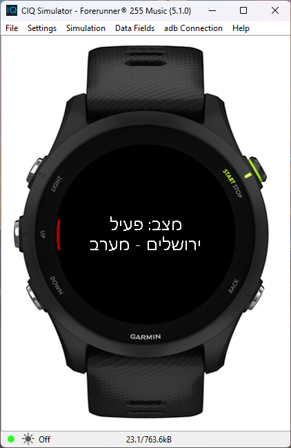
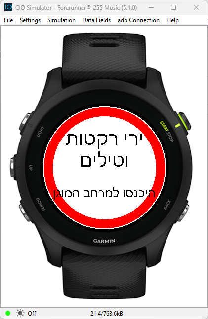

# Garmin Red Alert App

This is a Garmin watch app that shows **live alerts from Pikud Ha'Oref** (Israel's National Emergency Portal).

  
  

🛠️ **Tested on:** Garmin Forerunner 255 Music  
📡 **Relies on JSON file:** [https://www.oref.org.il/WarningMessages/alert/alerts.json](https://www.oref.org.il/WarningMessages/alert/alerts.json)

## What It Does
- Displays real-time emergency alerts
- Pulls data directly from the national alert system

## Notes
- Not affiliated with Pikud Ha'Oref or the IDF
- I take no responsibility for missed, delayed, or incorrect alerts

---

